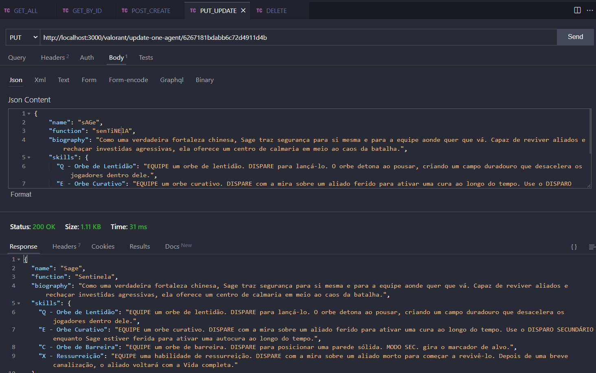

<body>
        <h1>Projeto API Valorant Agents</h1>
        

                
        

        <h2 style="margin-top:2rem">Descrição do Projeto</h2>
        

        Este foi o segundo Projeto desenvolvido no terceiro módulo do curso de programação back-end da Blue EdTech.
        O foco do projeto foi criar uma API em que realize todas as operações do CRUD usando o Mongo DB para persistir os dados.'
        Para conferir se o nome do Agente criado é o nome de um Agente real do jogo, foi usado uma API externa para salvar os nomes de todos os Agentes do Valorant para fazer essa verificação.
         
        

        <h2 style="margin-top:2rem">As Stacks utilizadas foram:</h2>
        

               
JavaScript

               
Node.Js

               
Express

               
Json

               
MongoDB

               
Mongoose

        

        <h2 style="margin-top:2rem">Desenvolvedor</h2>
        <h3>Lucas Marques</h3>
        <a href="https://www.linkedin.com/in/mlucasdev/">
                Meu Linkedin
        </a>
</body>
